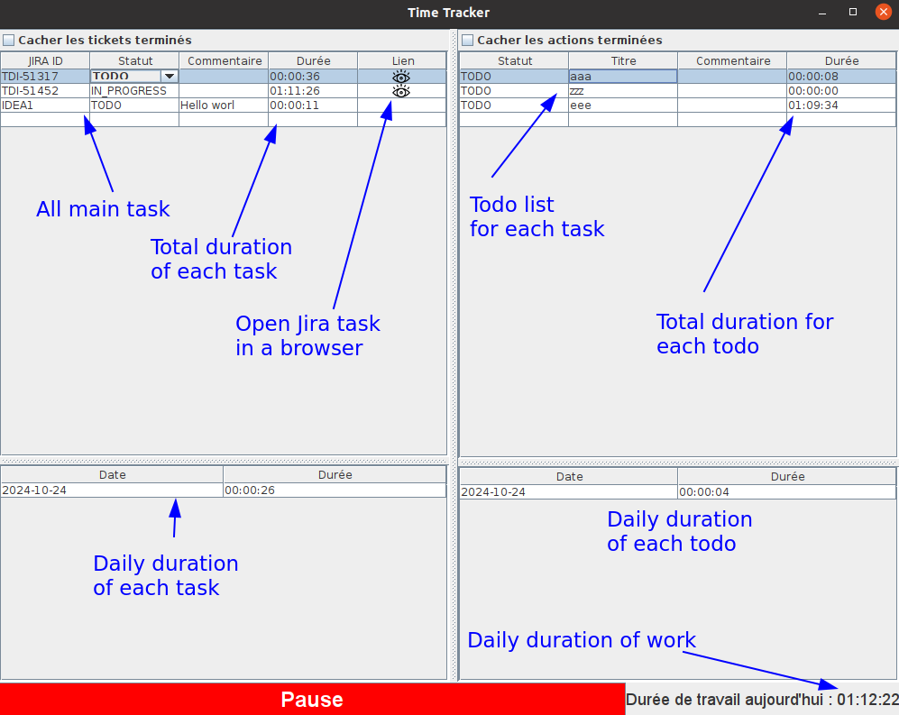

# time-tracker
A simple time tracker quickly developed with chatgpt-o1-preview.

To build:
```shell
$ mvn clean install
```

To launch:
```shell
$ java -jar target/timer-1.0-SNAPSHOT.jar 
```

I didn't change any chatgpt generated code, great job!
